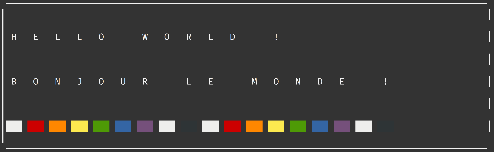
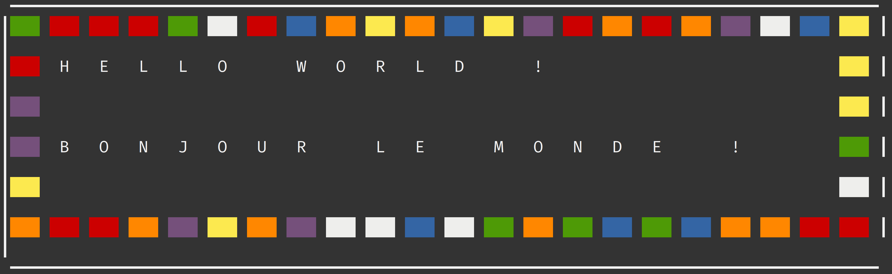
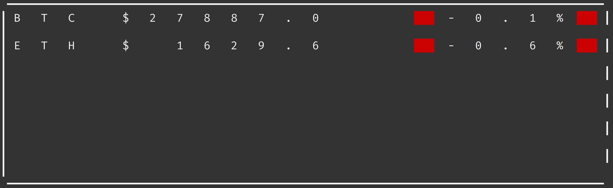
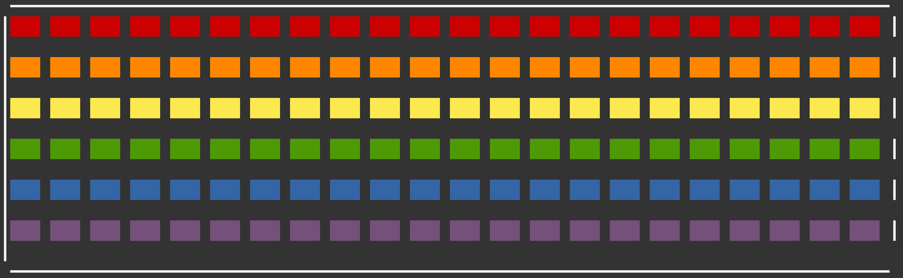
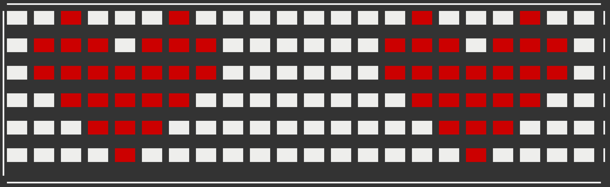

# Vestargo

## Description

Minimal control software for the Vestaboard display.

Also contains a minimal board simulator to test your sequence

```
cargo run vestargo-simulator
```

## Usage

To control what is displayed change the content of the sequence.yaml file.

Add templates to steps, each step has a duration in seconds

You can use the following templates in your sequence:

# Templates

## Dynamic

### Text



Displays given text, up to 6 lines of 22 characters.
Colors are represented by the following characters:
- '🟥' : Red
- '🟧' : Orange
- '🟨' : Yellow
- '🟩' : Green
- '🟦' : Blue
- '🟪' : Purple
- '◽' : White / - '█' : Filled
- '⬛' : Black

```yaml
- template: Text
  duration: 5
  text:
    -
    - 'Hello world !'
    -
    - 'Bonjour le monde !'
    -
    - '█🟥🟧🟨🟩🟦🟪◽⬛█🟥🟧🟨🟩🟦🟪◽⬛'
```

### HappyText



Displays given text surrounded by random colors, up to 4 lines of 20 characters.

```yaml
- template: HappyText
  duration: 5
  text:
    - 'Hello world !'
    -
    - 'Bonjour le monde !'
```

### Crypto



Display the price of cryptocurrencies and 1 day change. Based on coingecko API.

Supports up to 6 tickers.

Currently supported tickers:
- Btc
- Eth
- Bnb
- Sol

```yaml
- template: Crypto
  duration: 5
  tickers:
    - Btc
    - Eth
    - Bnb
    - Sol
```

## Static

### Rainbow



Displays a rainbow.

```yaml
- template: Rainbow
  duration: 5
```

### Hearts



Displays hearts.

```yaml
- template: Hearts
  duration: 5
```
